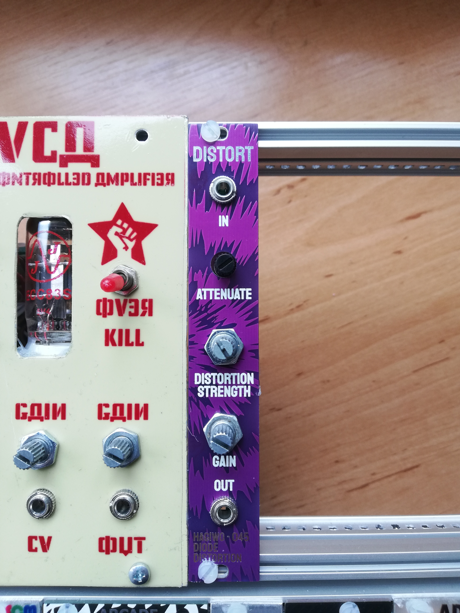
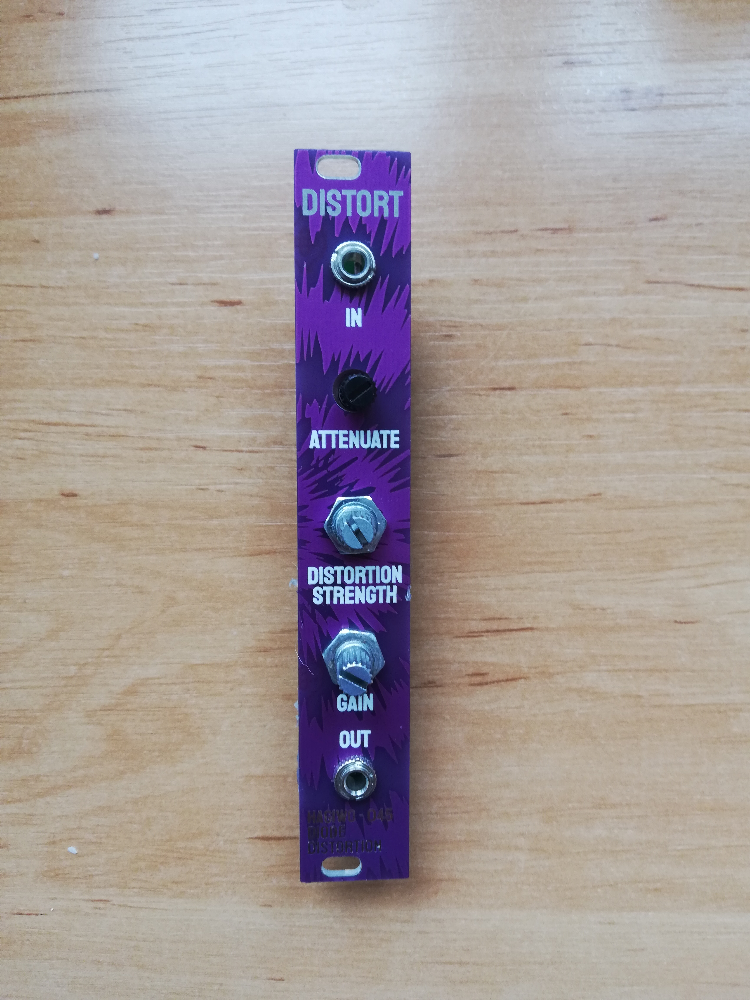
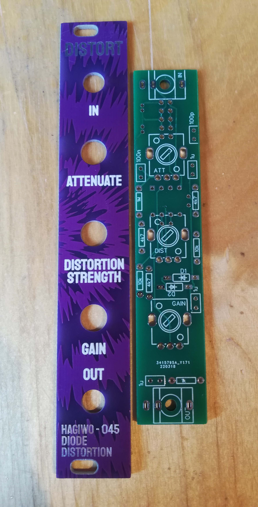
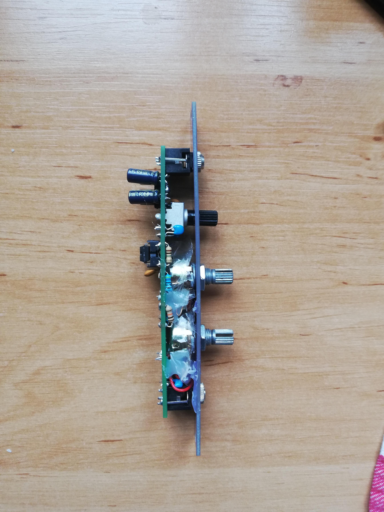
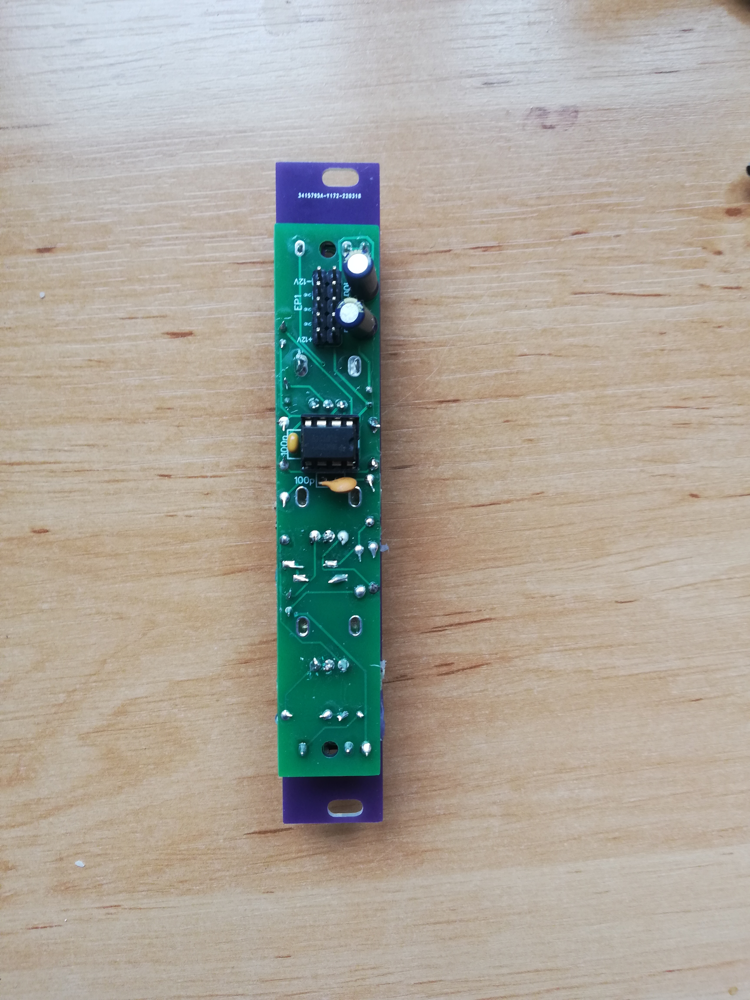

# HAGIWO Diode Distortion Eurorack Module

Through-hole 4HP  PCB version of the HAGIWO distortion eurorack module. 
### Current Status: Confirmed working, will update build guide and files later today.

## Hardware and PCB

 
You can find the schematic and BOM in the root folder. 
For the PCBs, the module has one circuit PCB and one panel PCB. 
You can order them on any common PCB manufacturing service, I used JLCPCB. For the circuit PCB, standard settings should be fine.
For the panel, since it has copper exposed, make sure to choose a lead free surface finish (LeadFree HASL, ENIG) and/or spraypaint your panels so that you don't get lead on your hands.

Build is super straight forward, but the 250K Pots specified by HAGIWO can be hard to source. I just used 1M instead, which probably changes how gain and distortion 
behave, but it still works so you can try that instead if you have a hard time sourcing 250k.
 
